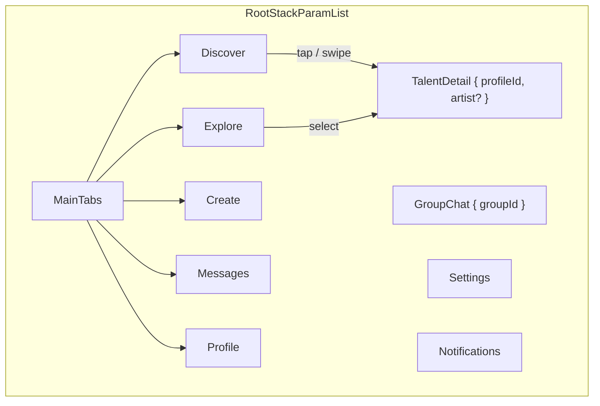

# The Stage — Arquitectura Frontend

React Native + Expo + TypeScript estricto. Descubrimiento de talento con mecánica **Tinder** (swipe) y perfiles **Bento Grid**.

## Tokens visuales (Figma — no alterar)

| Token | Valor | Uso |
|-------|-------|-----|
| Fondo absoluto | `#0B0B0B` | Canvas principal |
| Superficies / tarjetas | `#16161A` | Cards, bento, tab bar |
| Acento CTAs | `#7A0622` / gradiente actual en UI | Match, estados activos |

## Árbol de directorios

```
app/
├── App.tsx                          # NavigationContainer + fuentes Outfit
├── app.json
├── ARCHITECTURE.md                  # Este documento
├── README-arquitectura.md           # Manual ISO / seguridad
│
└── src/
    ├── components/                  # Kit UI reutilizable
    │   ├── TalentCard.tsx           # Tarjeta discover + gestos
    │   ├── ActionButtons.tsx        # Conectar / pasar / guardar
    │   ├── ProfileHeader.tsx        # Avatar + validación
    │   ├── CategoryChips.tsx        # Skills horizontales
    │   ├── MultimediaCarousel.tsx   # Hasta 7 clips + imágenes
    │   ├── SkeletonLoader.tsx       # Shimmer card / bento
    │   ├── EmptyState.tsx           # Fin de feed
    │   ├── ToastAlerts.tsx          # Match / errores
    │   ├── BentoCard.tsx
    │   ├── BentoGridShowcase.tsx
    │   ├── PrimaryButton.tsx
    │   ├── SpotlightFeed.tsx        # Variante legacy vertical
    │   └── index.ts
    │
    ├── gestures/
    │   ├── swipeEngine.ts           # Matemática pura del swipe
    │   └── index.ts
    │
    ├── hooks/
    │   ├── useSwipeGesture.ts       # PanResponder + Animated
    │   ├── useCasting.ts            # like / pass / bookmark
    │   └── useTalentSearch.ts
    │
    ├── navigation/
    │   ├── types.ts                 # RootStackParamList + tabs
    │   ├── MainTabNavigator.tsx     # 5 pestañas inferiores
    │   ├── RootNavigator.tsx        # Stack global
    │   └── AppNavigator.tsx         # Legacy (state local) — deprecado
    │
    ├── screens/
    │   ├── SpotlightFeedScreen.tsx  # Discover — stack de tarjetas
    │   ├── ScoutDashboardScreen.tsx # Explore — buscador
    │   ├── CreateScreen.tsx         # Create — perfil propio
    │   ├── MessagesScreen.tsx       # Messages
    │   ├── ProfileSettingsScreen.tsx# Profile — ajustes cuenta
    │   ├── ArtistProfileScreen.tsx  # TalentDetail — Bento perfil
    │   └── GroupChatScreen.tsx      # GroupChat — proyectos (v3)
    │
    ├── services/
    │   ├── api.ts                   # Axios + interceptores JWT
    │   └── mockData.ts
    │
    ├── store/
    │   ├── useStageStore.ts         # Feed, auth, matches
    │   └── index.ts
    │
    ├── theme/
    │   ├── constants.ts             # Tokens runtime (screens)
    │   └── index.ts                 # Design system extendido
    │
    └── types/
        ├── models.ts                # User, Profile, Connection, Group…
        └── index.ts                 # ArtistProfile, CastingMatch…
```

## Mapa de navegación



### `RootTabParamList`

| Ruta | Pantalla | Función |
|------|----------|---------|
| `Discover` | `SpotlightFeedScreen` | Motor swipe (like / pass / bookmark) |
| `Explore` | `ScoutDashboardScreen` | Categorías y grid |
| `Create` | `CreateScreen` | Gestión perfil / 7 videos |
| `Messages` | `MessagesScreen` | Chats 1:1 y grupos |
| `Profile` | `ProfileSettingsScreen` | Cuenta y premium |

### `RootStackParamList`

| Ruta | Parámetros |
|------|------------|
| `MainTabs` | `NavigatorScreenParams<RootTabParamList>` |
| `TalentDetail` | `{ profileId, artist?, fromTab? }` |
| `GroupChat` | `{ groupId, groupName? }` |
| `Settings` | `undefined` |
| `Notifications` | `undefined` |

### Gestos → acciones

| Gesto | `TalentSwipeAction` | Efecto |
|-------|---------------------|--------|
| Derecha | `like` | Casting / interés (`createMatch`) |
| Izquierda | `pass` | Descartar del feed |
| Arriba | `bookmark` | Destacar (API `recordConnection`) |
| Tap | — | `navigation.navigate('TalentDetail')` |

Umbral por defecto: **25%** ancho horizontal, **18%** alto para arriba; velocidad **0.35**.

## Módulo de gestos

- `src/gestures/swipeEngine.ts` — `resolveSwipeAction`, `getCardRotation`, `getSwipeExitOffset`
- `src/hooks/useSwipeGesture.ts` — integración Animated + PanResponder
- `src/components/TalentCard.tsx` — UI existente + sellos CONECTAR / PASAR / GUARDAR

## Capa de red (`services/api.ts`)

- Interceptor JWT (mock)
- Sanitización XSS en respuestas
- `fetchTalentFeed`, `sendCastingRequest`, `recordConnection`, `fetchBookmarks`

## Roadmap de producto

### MVP (v1) — actual

- [x] Feed swipe con foto
- [x] Perfil Bento (`TalentDetail`)
- [x] Navegación 5 tabs + stack tipado
- [ ] Auth real + chat 1:1

### Consolidación (v2)

- [ ] 7 videobooks nativos (`expo-av`)
- [ ] Buscador con filtros avanzados
- [ ] Matching inteligente backend

### Expansión (v3)

- [ ] `GroupChat` + audiciones
- [ ] Badges de validación
- [ ] Analíticas de visitas al portafolio

## Comandos

```bash
npm start
npm run ts:check
```
